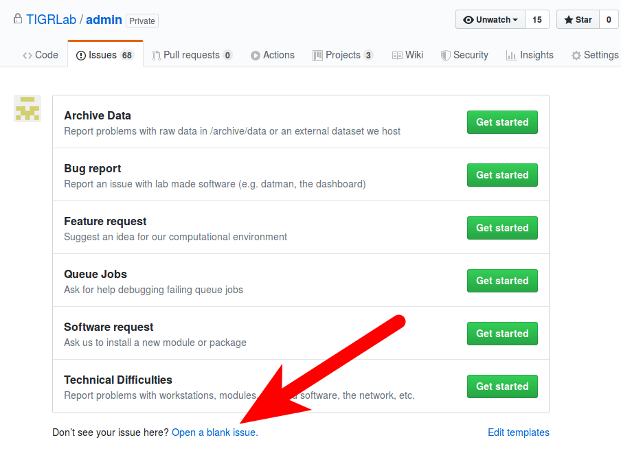

# Getting Help

## Contents

 1. [Help with Tech Problems and Archive Problems](#help-with-tech-problems-and-archive-problems)
 2. [Help with CAMH Problems](#help-with-camh-problems)
 3. [Help with the SCC](#help-with-the-scc)
 4. [Help with Scinet](#help-with-scinet)

## Help with Tech Problems and Archive Problems

If you notice something wrong with our systems (workstations, queue, file system, software etc.) or our archive or external data you can [open an issue here](http://github.com/TIGRLab/admin/issues).  We get emails when a new issue is opened, and will respond as quickly as we can.

If you follow that link it will take you to page that looks like below. Click the 'New Issue' button on the top right to get started.

After you've clicked the button it should bring up a list of issue templates you can choose from or you can choose to open a blank issue if your problem does not fit into these categories. The templates, if one is relevant to your problem, will help guide you to write a more informative issue and help make it easier for us to resolve your problem.

## Help with CAMH Problems

CAMH has a website for general IT help [available here](http://scotty.camh.ca/) (including info on [how to reset your CAMH password](http://scotty.camh.ca/how-to/reset-your-password)). Generally anything you need can be found by searching on insite.camh.net if you're using a computer on the camh network.

Important parts of the site include:

- Maintenance (ext 30000): [Info about their services here](http://insite.camh.net/Services_for_Staff/Maintenance/Maintenance7448.html)
- IMG (ext 6011): [Info about their services here](http://insite.camh.net/Services_for_Staff/Service_Desk/Requesting_IMG_Services/requesting_img_services11017.html)

## Help with the SCC

The SCC documentation [can be found here](http://info2.camh.net/scc/index.php/Main_Page). If you're having trouble logging in you can first contact Dawn for help. If you need a module to be made available on the SCC you can talk to Dawn or Kevin. Other technical problems should go directly to Andy Wang.

## Help with Scinet

SciNet official documentation [is found here](https://docs.scinet.utoronto.ca/index.php/Main_Page). Dawn, Kevin, Jerry or Mike can also be approached for any technical issues. If they can't help with your problem they may help you contact scinet's tech support team.
