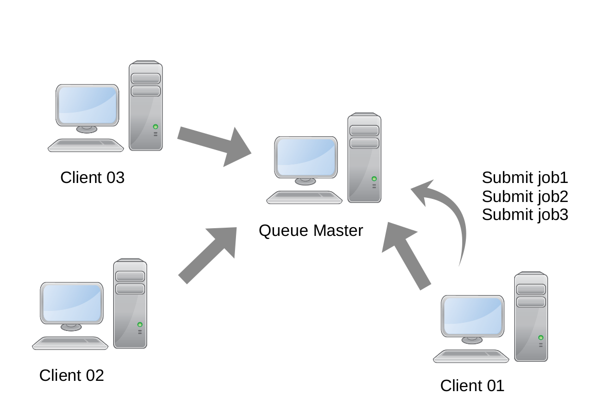
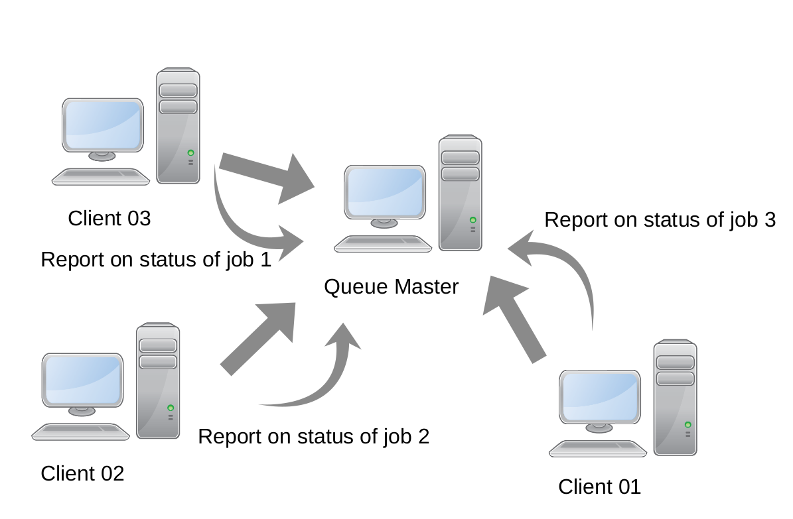

# Queue Basics

This page gives an overview of what a queue is and the basics of how it works. If you're looking for information on the queues that are available to us and how to access them [see here](https://github.com/TIGRLab/documentation/wiki/Compute-Clusters). If you're looking for documentation for our queue [see here](https://github.com/TIGRLab/TIGRSlurm-Docs).

## What the heck is a queue anyway?

A queue, also called a computing cluster, is just a group of computers that work together to run programs. There is usually a 'Queue master' which coordinates each of the machines. It receives 'jobs' (programs to run; can be as simple as a single bash command) from any machines with permission to submit work.

The queue master can then automatically assign these jobs to other machines in the cluster based on how busy they already are and other factors like the number of CPU cores and the amount of RAM. If a job requires a lot of these resources it can avoid assigning that job to machines not powerful enough to execute it and if there aren't any machines available to run a job (or aren't any powerful enough) the queue master can hold on to the job until a machine is free.

The queue master also gets periodic updates from each of its worker machines. If a machine gets turned off, or fails, or if something goes wrong with the job itself, the queue master will receive this info and can relay status updates to users.

## Important Takeaways

- When you submit a job it may run on a completely different machine than you expect. If you submit a bunch, each job could be running on a different computer.
- If your job takes any input files you have to read them from somewhere accessible to every machine (/projects or /scratch or /archive in the case of our lab's queue or the SCC's queue). If your script has any outputs you should also put them in a globally accessible place or your outputs will get 'stuck' on whatever machine the job ran on.
- If your job is using anything at all that is in your home folder it will fail or behave unexpectedly (home folders are local to each machine, and therefore different on every computer).
- If the queue master goes down for any reason, new jobs can't be submitted or assigned.
